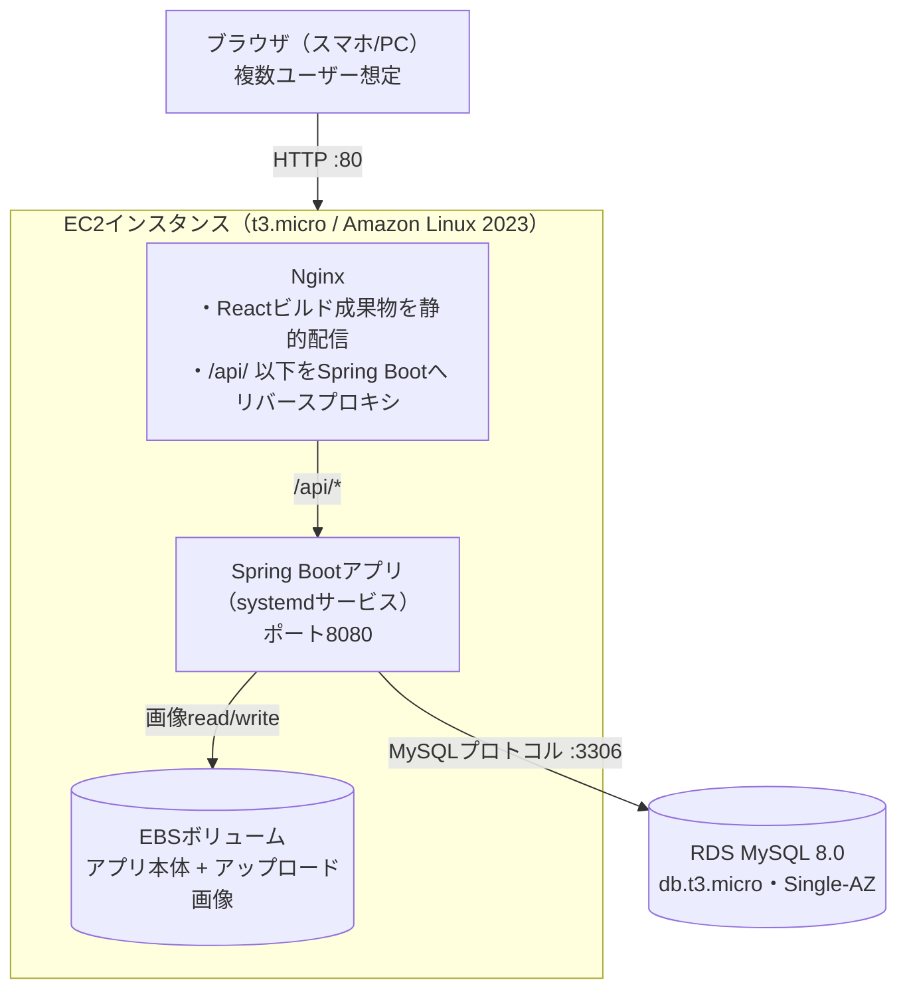

# Chococo AWSインフラ構成

作成日：2026年8月15日（初版）
[requirements.md](./requirements.md) 4章「インフラ費用はAWS無料枠の範囲内での運用を前提」を満たす構成を設計する。開発期間は約1ヶ月（[requirements.md](./requirements.md) 1.2）のため、12ヶ月間有効なAWS無料枠に十分収まる前提で構成する。

## 1. 設計方針

- [tech-stack.md](./tech-stack.md)で確定した構成（EC2上のSpring Boot + React、DBはMySQL）を、[requirements.md](./requirements.md) 5章の「データベース：AWS RDS」の方針通りRDSで運用する。開発期間が1ヶ月程度と短く、RDS無料枠の12ヶ月に十分収まるため、無料枠終了を理由にRDSを避ける必要はない（無料枠終了後もランニングコストを抑えたい長期個人利用プロジェクトであれば、DBをEC2上のDockerコンテナに同居させる構成も選択肢になるが、本プロジェクトはその前提に該当しない）
- 画像は[requirements.md](./requirements.md) 4章の方針通り、本番でもEC2ローカルディスク（EBS）に保存する。S3への移行は将来の拡張とする
- 保存する画像ファイル名は連番（記録ID等）を使わず、推測不可能なUUID（例：`e4b1a92a-....jpg`）を付与した上でNginxから静的配信する。JWT認証を経由しない配信経路のため、ファイル名自体を実質的な閲覧トークンとして扱う（詳細は3.4節）
- 本アプリは複数ユーザーによる一般公開・テスト利用を想定する（[requirements.md](./requirements.md) 1.2）ため、Webの入口（80/443番）は特定IPに絞らず公開する。認証・認可は[functional-spec.md](./functional-spec.md) 3.1節のJWTベースの仕組みで担保する

## 2. 全体構成図

## 3. 構成要素

### 3.1 EC2インスタンス

| 項目 | 内容 |
|---|---|
| インスタンスタイプ | t3.micro（無料枠対象：750時間/月×12ヶ月）。アカウントによってはt2.microが対象の場合もあるため、構築時に`aws ec2 describe-instance-types`等で対象を確認する |
| AMI | Amazon Linux 2023 |
| EBSボリューム | gp3, 20〜30GB（無料枠上限30GB以内）。アプリ本体とアップロード画像を配置 |
| Elastic IP | 1つ割り当てる（インスタンス起動中は無料。停止したまま放置すると課金されるため注意） |
| リージョン | 東京（ap-northeast-1） |
| 実行方式 | Spring Bootアプリはsystemdサービスとして常駐させ、Nginxをリバースプロキシとして前段に置く（Dockerを使う場合は1コンテナ構成でも可） |

### 3.2 RDS（MySQL）

| 項目 | 内容 |
|---|---|
| エンジン | MySQL 8.0 |
| インスタンスクラス | db.t3.micro（無料枠対象：750時間/月×12ヶ月）。こちらも構築時に対象クラスを確認する |
| 構成 | Single-AZ（無料枠はSingle-AZのみ対象。Multi-AZは課金対象のため使用しない） |
| ストレージ | 20GB（無料枠上限） |
| Public Accessibility | 無効（EC2からのみ接続可能とし、インターネットに直接公開しない） |

### 3.3 セキュリティグループ

**EC2用セキュリティグループ**

| ポート | 用途 | 許可元 |
|---|---|---|
| 22 (SSH) | サーバー管理用 | 開発者のグローバルIPのみ |
| 80 (HTTP) | アプリ公開用 | 0.0.0.0/0（複数ユーザーへの一般公開のため） |
| 443 (HTTPS) | 将来のHTTPS化用に開けておく（当面未使用） | 0.0.0.0/0 |

**RDS用セキュリティグループ**

| ポート | 用途 | 許可元 |
|---|---|---|
| 3306 (MySQL) | DB接続 | EC2用セキュリティグループのみ（インターネットには一切公開しない） |

**HTTPS化について**：現時点では独自ドメインを取得していないためHTTPのみで公開する。JWTトークンを含む通信が平文になる点は認識した上で、学校課題としての利用範囲（一般公開・テスト利用）ではリスクを許容する。独自ドメインを取得した場合はLet's Encrypt（Certbot）でNginxにHTTPS設定を追加できる（追加費用なし）。ロードバランサ（ALB等）は無料枠の対象外のため使用しない。

### 3.4 画像ファイルの配信とアクセス制御

アップロード画像はNginxが静的ファイルとしてそのまま配信する（JWT認証を通らない）。連番の記録IDをファイル名に使うと、URLを推測するだけで他人の画像に到達できてしまうため、以下の方針を採用する。

- サーバー側で画像を保存する際、元のファイル名は使わず`UUID`（例：`java.util.UUID.randomUUID()`）を生成してファイル名とする（例：`e4b1a92a-....jpg`）
- `records.photo_path`にはこのUUIDファイル名を含むパスを保存し、APIレスポンスの`photoUrl`もこのパスをそのまま返す（[api-spec.md](./api-spec.md) 3.5, 3.6参照）
- この方式は「URLを知っていれば（例えばリンクを共有すれば）誰でも閲覧できる」状態を許容する妥協案であり、厳密な所有権チェックは行わない。学校課題としての利用範囲でリスクを許容する（本番相当の要件が出た場合はJWT認証付きの画像配信エンドポイントへの切り替えを検討する）

## 4. データ永続化・バックアップ

- RDSは自動バックアップ機能（無料枠の範囲内、DBストレージ容量と同じ上限まで）を有効にし、最低限の復旧手段を確保する
- 画像ファイル（EBS上）はRDSのような自動バックアップの仕組みがないため、v1ではバックアップなしで運用する。必要に応じてEBSスナップショットの手動取得を検討する（無料枠にはスナップショット用ストレージ1GBが含まれる）

## 5. 無料枠の範囲・コスト見積もり

| 項目 | 無料枠の内容 | 想定コスト |
|---|---|---|
| EC2 (t3.micro) | 750時間/月×12ヶ月 | $0 |
| EC2用EBS (gp3) | 30GB/月 | $0（20〜30GBに収める） |
| RDS (db.t3.micro, MySQL) | 750時間/月×12ヶ月 | $0 |
| RDSストレージ | 20GB | $0 |
| データ転送（アウト） | 100GB/月 | $0（テスト利用規模なら十分収まる想定） |
| Elastic IP | インスタンス起動中は無料 | $0 |
| **合計（12ヶ月以内）** | | **$0想定** |

開発期間は約1ヶ月（[requirements.md](./requirements.md) 1.2）のため、無料枠12ヶ月の範囲に十分収まる。12ヶ月経過後も運用を続ける場合は、EC2 + RDSであわせて月$20前後のコストが発生する見込みだが、本課題の期間内では対象外の検討事項とする。

## 6. 未確定・今後の検討事項

- デプロイ手順（SSH接続してのGit pull + 再起動を想定。CI/CD化は対象外）
- 独自ドメイン取得・HTTPS化の要否とタイミング
- 開発者のグローバルIPが変動した場合のセキュリティグループ更新運用
- 複数ユーザーによるテスト利用時の想定同時接続数・負荷（t3.microのスペックで十分か）
