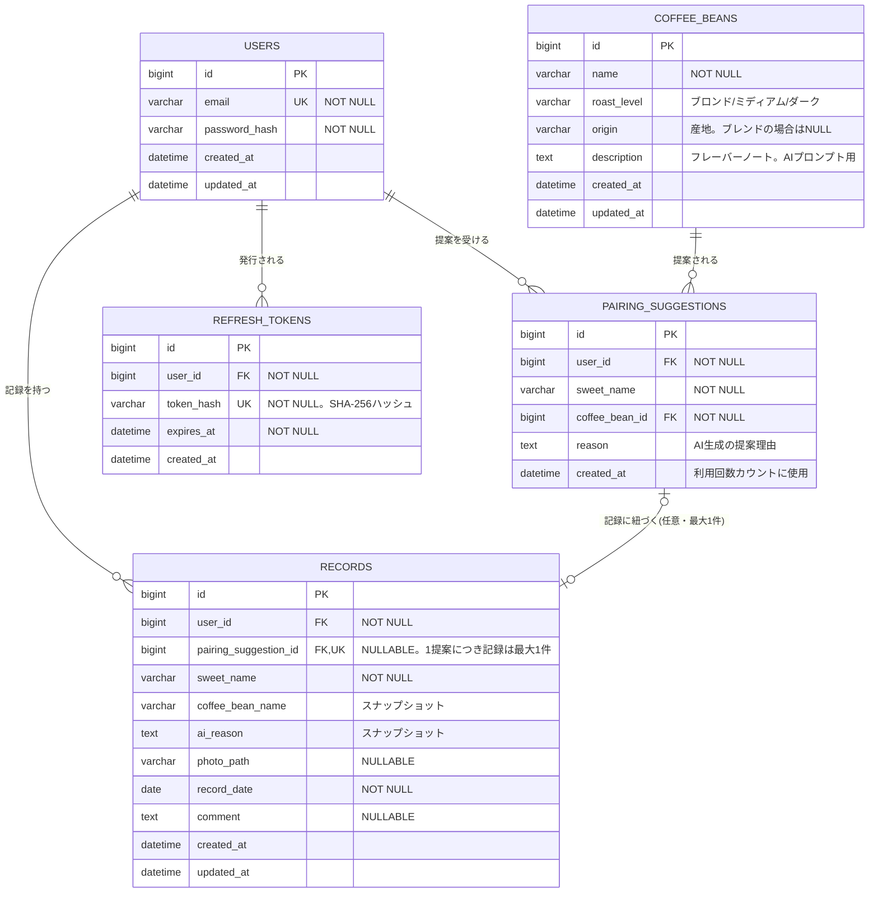

# Chococo データベース設計書（ER図・テーブル定義）

作成日：2026年8月15日（初版）
対象：[requirements.md](./requirements.md) 3.1 MVP機能に対応

## 1. ER図

## 2. テーブル定義

### 2.1 users（ユーザー）

| カラム名 | 型 | 制約 | 説明 |
|---|---|---|---|
| id | BIGINT | PK, AUTO_INCREMENT | ユーザーID |
| email | VARCHAR(255) | UNIQUE, NOT NULL | ログインID兼用 |
| password_hash | VARCHAR(255) | NOT NULL | BCrypt等でハッシュ化して保存 |
| created_at | DATETIME | NOT NULL | 作成日時 |
| updated_at | DATETIME | NOT NULL | 更新日時 |

### 2.2 coffee_beans（コーヒー豆マスタ）

| カラム名 | 型 | 制約 | 説明 |
|---|---|---|---|
| id | BIGINT | PK, AUTO_INCREMENT | 豆ID |
| name | VARCHAR(100) | NOT NULL | 豆の名前 |
| roast_level | VARCHAR(20) | NOT NULL | 焙煎度。`ブロンド` / `ミディアム` / `ダーク` のいずれか（アプリ側でenum管理） |
| origin | VARCHAR(50) | NULLABLE | 産地（単一原産国の場合のみ設定。ブレンドはNULL） |
| description | TEXT | NOT NULL | フレーバーノート・味の特徴。AIへの提案プロンプトに渡す文脈として利用 |
| created_at | DATETIME | NOT NULL | 作成日時 |
| updated_at | DATETIME | NOT NULL | 更新日時 |

初期データは管理画面を作らず、マイグレーション（seedデータ）で投入する想定。MVPでは編集UIなし。

**シードデータ（10種、2026年8月15日確定）**

スターバックス コーヒー ジャパンの公式サイト（[コーヒー豆を選ぶ](https://www.starbucks.co.jp/coffee/roast.html)）に掲載の焙煎度・産地・フレーバー情報を事実面の参考にしつつ、商品名は商標回避のため独自命名した。風味が近く重複していた組み合わせ（フレンチロースト／イタリアンロースト等）は1種に統合し、AIが選び分けやすいようフレーバー系統が分散するよう10種に絞り込んだ。

| No. | name | roast_level | origin | description |
|---|---|---|---|---|
| 1 | マイルド ブレンド | ブロンド | NULL | 軽やかで親しみやすく、酸味・苦味ともに控えめ |
| 2 | デイリー ブレンド | ミディアム | NULL | バランス重視の飲みやすい定番の味わい |
| 3 | フローラル ブレンド | ミディアム | NULL | 華やかな香りとほどよいコク |
| 4 | ケニア | ミディアム | ケニア | フルーティで鮮やかな酸味 |
| 5 | グアテマラ | ミディアム | グアテマラ | ココアを思わせる上品な甘み |
| 6 | コロンビア | ミディアム | コロンビア | ナッツを思わせる香ばしさ |
| 7 | ディープ ロースト ブレンド | ダーク | NULL | 力強く深いコクとキレのある苦味 |
| 8 | エスプレッソ ブレンド | ダーク | NULL | ミルクと好相性の濃厚な風味 |
| 9 | スマトラ | ダーク | インドネシア | 大地を思わせるどっしりとしたコク |
| 10 | スパイス ブレンド | ダーク | NULL | ハーブ香とスパイシーな余韻 |

### 2.3 pairing_suggestions（AIペアリング提案ログ）

| カラム名 | 型 | 制約 | 説明 |
|---|---|---|---|
| id | BIGINT | PK, AUTO_INCREMENT | 提案ID |
| user_id | BIGINT | FK → users.id, NOT NULL | 提案を受けたユーザー |
| sweet_name | VARCHAR(100) | NOT NULL | 入力されたスイーツ名 |
| coffee_bean_id | BIGINT | FK → coffee_beans.id, NOT NULL | AIが選んだ豆 |
| reason | TEXT | NOT NULL | AIが生成した提案理由 |
| created_at | DATETIME | NOT NULL | 提案日時 |

**インデックス**：`(user_id, created_at)` に複合インデックス。1日10回の利用上限チェック（`WHERE user_id = ? AND created_at >= 当日0時`のCOUNT）に使用する。

このテーブルはAI呼び出しのたびに1件追加する。記録として保存するかどうかに関わらず全件残すことで、利用回数カウントと将来の分析用途を両立させる。

### 2.4 records（スイーツ記録）

| カラム名 | 型 | 制約 | 説明 |
|---|---|---|---|
| id | BIGINT | PK, AUTO_INCREMENT | 記録ID |
| user_id | BIGINT | FK → users.id, NOT NULL | 記録したユーザー |
| pairing_suggestion_id | BIGINT | FK → pairing_suggestions.id, UNIQUE, NULLABLE | 元になった提案（履歴追跡用）。UNIQUEにより1つの提案から作成できる記録は最大1件に制限する |
| sweet_name | VARCHAR(100) | NOT NULL | スイーツ名 |
| coffee_bean_name | VARCHAR(100) | NULLABLE | 提案されたコーヒー豆名（スナップショット） |
| ai_reason | TEXT | NULLABLE | AIの提案理由（スナップショット） |
| photo_path | VARCHAR(500) | NULLABLE | 写真の保存パス（初期はサーバー内パス、将来S3のURLに移行） |
| record_date | DATE | NOT NULL | 記録日（カレンダー表示のキー） |
| comment | TEXT | NULLABLE | 感想 |
| created_at | DATETIME | NOT NULL | 作成日時 |
| updated_at | DATETIME | NOT NULL | 更新日時 |

**インデックス**：`(user_id, record_date)` に複合インデックス。カレンダー一覧表示（月単位の記録取得）に使用する。

**設計判断：`coffee_bean_name` / `ai_reason` をスナップショットとして保存する理由**
`records` は `pairing_suggestions` を経由すれば `coffee_beans` にたどり着けるが、あえて名前と理由をコピーして持たせている。理由は、後日 `coffee_beans` マスタの名称や説明文を更新しても、過去に保存済みの記録の表示内容が勝手に変わらないようにするため（記録は「その時点でAIが何を提案したか」のスナップショットであるべき）。JOIN数を減らせる副次効果もある。

**設計判断：`pairing_suggestion_id` にUNIQUE制約を付けた理由**
同じAI提案から複数の記録を作れてしまうと、ER図が表現する「1提案・1記録」という意図（[functional-spec.md](./functional-spec.md) 3.3節）とスキーマが食い違う。UNIQUE制約で最大1件に制限し、既に使用済みの提案IDで記録作成を試みた場合はAPI層で409エラーとする（[api-spec.md](./api-spec.md) 3.6節）。

### 2.5 refresh_tokens（リフレッシュトークン）

| カラム名 | 型 | 制約 | 説明 |
|---|---|---|---|
| id | BIGINT | PK, AUTO_INCREMENT | トークンID |
| user_id | BIGINT | FK → users.id, NOT NULL | 発行先ユーザー |
| token_hash | VARCHAR(64) | UNIQUE, NOT NULL | リフレッシュトークンのSHA-256ハッシュ（生の値はDBに保存しない） |
| expires_at | DATETIME | NOT NULL | 有効期限（発行から14日後） |
| created_at | DATETIME | NOT NULL | 発行日時 |

`user_id` にUNIQUE制約は付けない。1ユーザーが複数端末で同時にログインすることを許容し、それぞれ別のレコードとして管理する（[auth-design.md](./auth-design.md) 4-2節）。ローテーション・失効のたびに該当レコードを削除する運用のため、`updated_at`は持たない。

## 3. 決定事項（2026年8月15日 追記）

前回の未確定事項について、以下の通り決定した。

| No. | 論点 | 決定内容 | 設計への反映 |
|---|---|---|---|
| 1 | 1日1ユーザーにつき記録は複数可か | **複数可とする** | `records` はそのまま複数行を許容。カレンダーUIは1日に複数記録がある場合、件数バッジ or サムネイル並びで表示（requirements.md 3.1 No.4に反映済み） |
| 2 | 提案なしで記録だけ作成できるか | **できる（AI提案は任意）** | `pairing_suggestion_id` / `coffee_bean_name` / `ai_reason` は引き続きNULLABLEのままでよい（変更不要）。requirements.md 3.1 No.3の文言を修正済み |
| 3 | 利用回数カウントの日付境界 | **JST（日本時間）基準** | `pairing_suggestions` の1日10回チェックは「JSTの0時〜23:59:59」を1日の単位として `created_at` を集計する。サーバーのタイムゾーン設定に関わらず、クエリ側でJSTに変換して判定する（実装はAPI設計書で詳細化） |
| （4） | `coffee_beans` の初期データ件数・分類軸 | 本表とは別に2.2節「シードデータ」で確定済み | 決定事項リストとしてはNo.4を欠番扱いにせず、ここに参照を残す |
| 5 | 論理削除の要否 | **物理削除でよい（`deleted_at`は導入しない）** | 記録の編集・削除をMVPに含めることが決定（requirements.md 3.1 No.5）。監査要件がないため、DELETEは物理削除でシンプルに実装する。ただし削除時は `photo_path` が指す画像ファイルもあわせて削除する処理が必要（アプリケーションサーバー内保存のため、DBレコードだけ消すとファイルが残り続ける） |
| 6 | `records.pairing_suggestion_id` の一意性 | **UNIQUE制約を付ける** | 1つのAI提案から作成できる記録を最大1件に制限する（2.4節参照）。ER図が表現する「1対1」の意図とスキーマを一致させるため |

## 4. 残っている未確定事項

なし。DB設計に関する主要な論点は本ドキュメントで確定した。認証まわりの詳細（アクセストークン・リフレッシュトークン）は[auth-design.md](./auth-design.md)を参照。
