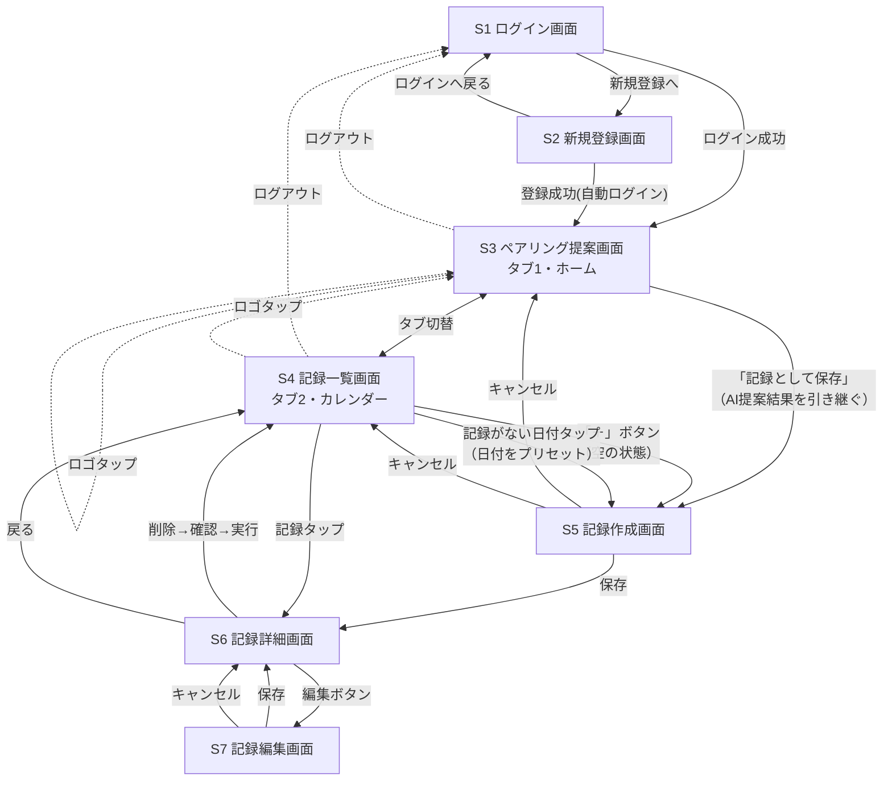

# Chococo 画面遷移図

作成日：2026年8月15日（初版）
対象：[requirements.md](./requirements.md) 6章「画面構成（想定）」を具体化したもの

## 1. ナビゲーション構造

ログイン後は「ペアリング提案」「記録一覧（カレンダー）」の2つをタブで常時切替できる構成とする（インスタグラム風の常時ナビに近い形）。タブバーが表示されるのはこの2画面のみで、記録の作成・詳細・編集画面はタブの上に積み重なる「ドリルダウン」画面として扱い、戻るボタンで呼び出し元に戻る。

記録作成画面（S5）は2つの入り口を持つ共通画面とする。AI提案エリアは入り口によらず常に表示し、「提案が未取得か・取得済みか」という画面内の状態だけが入り口ごとに異なる。
- **入り口①**：ペアリング提案画面でAI提案を受けた後、「この提案を記録として保存」から遷移（AI提案結果がプリセットされた状態で開く）
- **入り口②**：記録一覧画面の「＋」ボタン、または記録がない日付セルのタップから直接遷移（AI提案が未取得の状態で開く。画面内の「AIに提案してもらう」ボタンからその場で提案を取得できる。S3の[POST /api/pairings/questions・POST /api/pairings](./api-spec.md) 3.4・3.5節と同じAPI・同じ1日5回の利用上限を共有する）。「＋」は日付欄が今日の日付、日付セルのタップはタップした日付が初期値になる点のみが異なる

提案を取得せず記録のみを保存することも引き続き可能（AIペアリング提案を経由しなくても記録だけを保存できるという決定。[database-design.md](./database-design.md) 3章 決定事項No.2）。

## 2. 画面一覧

| ID | 画面名 | 概要 | 主な要素・操作 |
|---|---|---|---|
| S1 | ログイン画面 | メールアドレス＋パスワードでログイン | ログインフォーム、新規登録画面へのリンク |
| S2 | 新規登録画面 | メールアドレス＋パスワードで新規登録 | 登録フォーム、ログイン画面へのリンク |
| S3 | ペアリング提案画面（タブ1・ホーム） | スイーツ名を入力し、AIが生成する追加質問（1〜2問・選択式）に回答してからAIにコーヒー豆を提案してもらう | スイーツ名入力欄、「AIに提案してもらう」ボタン、追加質問（選択式）、提案結果（豆の名前・理由）表示、「記録として保存」ボタン、ログアウトアイコン |
| S4 | 記録一覧画面（タブ2） | 保存済み記録をカレンダー形式で一覧表示 | 月送りカレンダー、日付ごとの記録サムネイル／件数バッジ、「＋」ボタン（新規記録作成）、ログアウトアイコン |
| S5 | 記録作成画面 | 新しい記録を保存する（入り口①②共通） | 写真アップロード、スイーツ名、日付、感想入力欄、（入り口①の場合のみ）AI提案結果のプレビュー、保存／キャンセルボタン |
| S6 | 記録詳細画面 | 1件の記録の内容を表示 | 写真・スイーツ名・日付・感想・（あれば）AI提案結果の表示、編集ボタン、削除ボタン |
| S7 | 記録編集画面 | 既存の記録を編集する | S5と同じ入力項目（既存データがプリセットされた状態）、保存／キャンセルボタン |

## 3. 画面遷移図

## 4. 補足・設計判断

- **タブバーの表示範囲**：S3・S4のみに常時表示。S5〜S7はドリルダウン画面のためタブバーを隠し、戻る操作で呼び出し元（S3/S4またはS6）に戻る。
- **S5（記録作成画面）を共通化した理由**：入り口①②で表示項目は完全に共通（AI提案の有無は入り口ではなく画面内の状態として持つ）ため、画面を分けずに1つのコンポーネントとして扱う。API設計上も「記録作成」のエンドポイントは1本で、`pairing_suggestion_id` の有無だけで挙動が変わる想定。
- **削除後の遷移先**：S6から削除した場合はS4（記録一覧）に戻る。S6への遷移元がS4またはS5保存後のいずれであっても、削除後は一覧に戻すことで迷子にならないようにする。
- **ログアウト導線**：タブバーが常時表示されるS3・S4のヘッダーに「ログアウト」ボタンを置く。アイコンのみだと誤タップ・見落としの懸念があるため、テキストラベルのみのボタンとする。S5〜S7は必ずS3またはS4を経由してドリルダウンする画面のため、実質的にどの画面からもログアウト操作に到達できる。タップすると`POST /api/auth/logout`を呼び出してリフレッシュトークンをサーバー側で失効させた上でS1へ遷移する（[functional-spec.md](./functional-spec.md) 3.1節、[auth-design.md](./auth-design.md) 4-2節）。
- **ロゴタップ導線**：S3・S4のヘッダー左の「Chococo」ロゴをタップ可能にし、S3（ペアリング提案画面）へのショートカットとする。S3にいる場合は自画面への遷移（実質的な変化なし）。

## 5. 残っている未確定事項

なし。ヘッダー／タブバーのレイアウトは[wireframes.md](./wireframes.md)で確定した。
